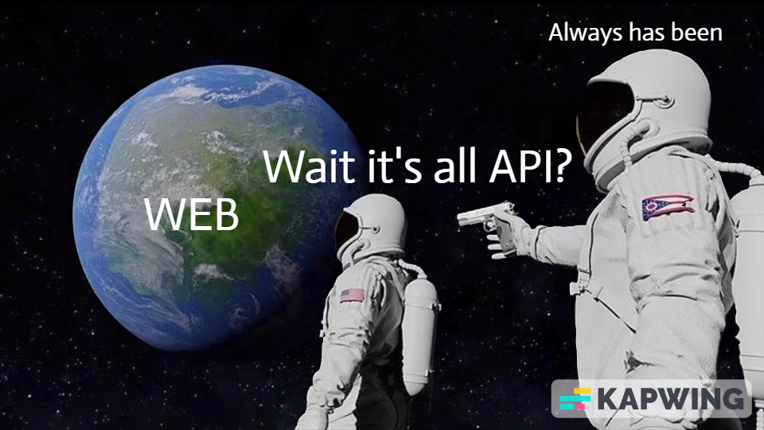

## [SDF10] API Learning Reflection 🧠

Welcome to the [SDF10] API Learning Reflection! Through this exercise, you will reflect on key concepts, practical experiences, and the tools you've encountered or used in API interactions.

1. **Understanding and Application**: Reflecting on the key concepts, can you explain in your own words what an API is and its significance in software development? Provide an example of how you have used or encountered an API in a project or a practical scenario.

**A**pplication **P**rogramming **I**nterface, allows components, programs and systems to communicate with one another,

* toUpperCase() is an example of an API
* Spotify displaying on your Discord activity is an API
* Transferring funds from bank to bank is an API

Any time anything happens or is displayed 9/10 an API is involved.

2. **Conceptual Distinctions**: How would you differentiate between an interface and an API? 

API is a type of interface, specifically for allowing components, programs and systems to communicate whereas an Interface allows two computer programs to exchange information.

(UI vs Web API, A UI is what a user sees when they go to a page and interact with it, whereas a Web API runs in the background i.e. a music streaming platform, a user requests to play a song, the Web API request it from the hosts server, and sends it back to the user)

3. **Components and Types of APIs**: Can you identify the main components of an API and describe their roles? Reflect on the different types of APIs mentioned (e.g., Web APIs, RESTful APIs) and discuss which type you find most intriguing or useful, and why.

API's three main components are:
* **API client** assembling and directs an API request 

* **API request** allows one application to request data or services from another application (in this example REST API request components are used):
    * **Endpoint** is a dedicated URL that provides access to a specific resource
    * **Method** defines the operation that the client would like to perform on the specified resource
    * **Parameters** variables that are passed to an API endpoint to provide specific instructions for the API to process
    * **Request headers** key-value pairs that provide additional information about the request
    * **Request body** includes the actual data that is necessary to create, update, or delete a resource

* **API server** sends the correct endpoint on the API server for processing, it handles authentication, validating input data, retrieving or manipulating data from a database, and returning the appropriate response to the client

* **API response** the data or information that is returned from a server when an API request is sent, examples of common components:
    * **Status code**
    * **Response headers**
    * **Body**

API Types:
* **Web** is an application programming interface for the Web. 
* **REST** a set of architectural constraints

Favorite API:
* **WebGL** is a cross-browser JavaScript library and API used to create and display animated 3D computer graphics in a web browser using WebGL.

4. **Practical Application and Tools**: Reflect on your experience with API exploration and implementation. Have you used any specific tools (such as Curl or API exploration tools) or libraries to interact with APIs? 

**Tailwind** used to style a few projects.

5. **Learning and Improvement**: Considering the key concepts and your practical experiences, identify one area related to APIs where you feel confident and one area where you see a need for improvement. What steps will you take to enhance your understanding and skills in the area you wish to improve?

* **Confident** in basic understanding and usage
* **improvement** design and usage

